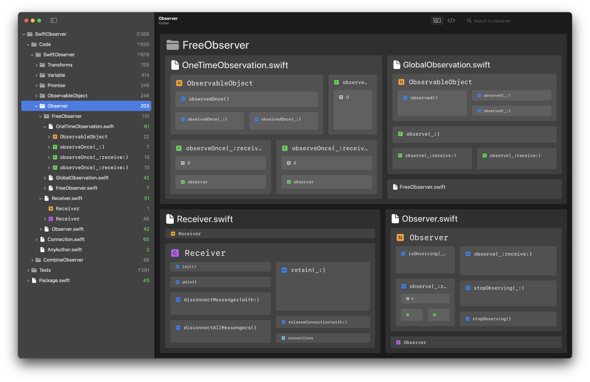

# LSPService for Codeface

LSPService is a free open source webservice that can offer Codeface finer granularity and information about actual architecture:

 

For example, it can retrieve symbols (like classes and functions) plus the dependencies between them from your code base.

You can simply download LSPService and run it locally on your machine. Codeface will automatically detect LSPService and talk to it.

## Downloads

   

        <a href="/codeface/lspservice/binaries/arm64-apple-macosx/LSPService.zip" download>
             &nbsp; LSPService for Apple Silicon
        </a>
   

   

        <a href="/codeface/lspservice/binaries/x86_64-apple-macosx/LSPService.zip" download>
             &nbsp; LSPService for Intel Chips
        </a>
   

