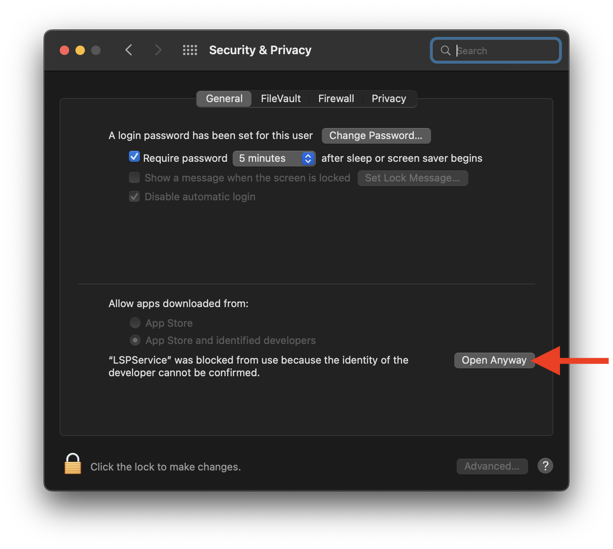

# LSPService for Codeface

LSPService is a free open source webservice that can provide Codeface finer granularity and information about actual architecture:

 

For example, it allows Codeface to show symbols (like classes and functions) and dependencies in your code base.

## Download and Run

Simply download LSPService and run it locally on your machine. Codeface will automatically detect LSPService and talk to it.

<div class="grid-x small-up-1 medium-up-2 grid-margin-y grid-margin-x">
   <div class="cell">
        <a href="/codeface/lspservice/binaries/arm64-apple-macosx/LSPService.zip" download>
             &nbsp; LSPService for Apple Silicon
        </a>
   </div>
   <div class="cell">
        <a href="/codeface/lspservice/binaries/x86_64-apple-macosx/LSPService.zip" download>
             &nbsp; LSPService for Intel Chips
        </a>
   </div>
</div>

On the first attempt to launch LSPService, you'll probably need to confirm your intention to open it via the security settings:



LSPService will run in terminal, and as long as it's running there, the service is available. Check: <http://localhost:8080>.

## Add Language Support

LSPService automatically supports Swift, Objective-c, C and C++ if Xcode is installed.

But generally, you must provide it the location of the corresponding [LSP server](https://langserver.org): LSPService creates an `LSPServiceConfig.json` file on launch if the file doesn't exist yet. If the file exists, it loads LSP server configurations from the file. The JSON structure is quite self-explanatory:

```
{
  "swift" : {
    "path" : "/usr/bin/xcrun",
    "arguments" : [
      "sourcekit-lsp"
    ],
    "environment" : {
      "SOURCEKIT_LOGGING" : "0"
    }
  }
}
```

Just add language server entries to the file and then restart LSPService. Arguments and environment can of course remain empty.

More [infos on LSPService are on GitHub](https://github.com/flowtoolz/LSPService).
