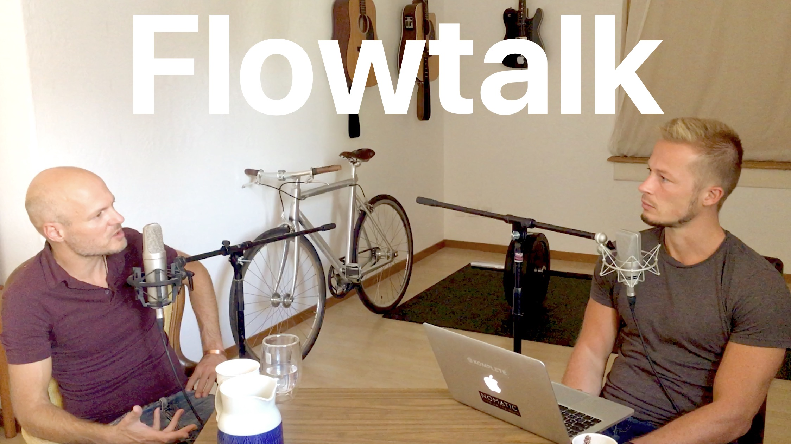
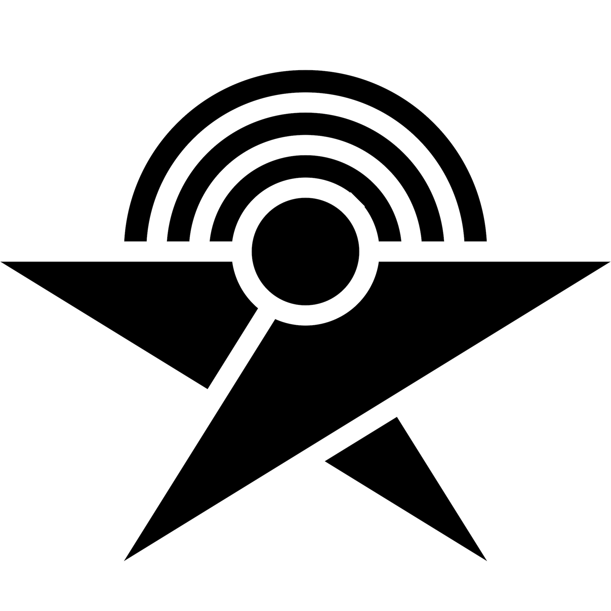

    
Flowtalk is a (mostly german) podcast. Our theme is **flow** as a state of ultimate focus, awareness, fulfilment, playfulness, naturalness, self-expression, productivity and inner peace. We talk about self-development, philosophy, psychology, spirituality, business, creativity, society, culture and more.
 
 

    
    

        
    

    
    

        
    

    
    

        
    

    
    

        
    

    
    

        
    

    
    

        
    

    
    

        
    

    
    

        
    

    
    

        
    

    

<h2>#3 - Nicolas Alschibaja, Sebastian Telle</h2>

    

        
    

    

        Wir unterhalten uns über Authentizität, Podcasting, Flow, Kreativität, Gesellschaft, Einheitsbewusstsein, persönliche Transformation, Wahrnehmung, Geist, Intuition, Meditation und mehr.
         
         
        <a href="http://nicolas-alschibaja.de" target="_blank">
            nicolas-alschibaja.de
        </a>
         
        <a href="http://flowlistapp.com" target="_blank">
            flowlistapp.com
        </a>
    

<h2>#2 - Sebastian Telle</h2>

    

        
    

    

        Sebastian Telle ist App-Architekt und kreativer Querdenker. Wir unterhielten uns über seine Hintergrundgeschichte, die neue App Flowlist und über Kommunikation.
         
         
        <a href="http://flowlistapp.com" target="_blank">
            flowlistapp.com
        </a>
    

<h2>#1 - Nicolas Alschibaja</h2>

    

        
            

    

        Nicolas Alschibaja ist ein spiritueller Sucher, Autor und Coach. In dieser Pilotfolge von Flowtalk unterhalten wir uns über seine Hintergrundgeschichte sowie über Bewusstsein, Präsenz und Gelassenheit.
         
         
        <a href="http://nicolas-alschibaja.de" target="_blank">
            nicolas-alschibaja.de
        </a>
    

