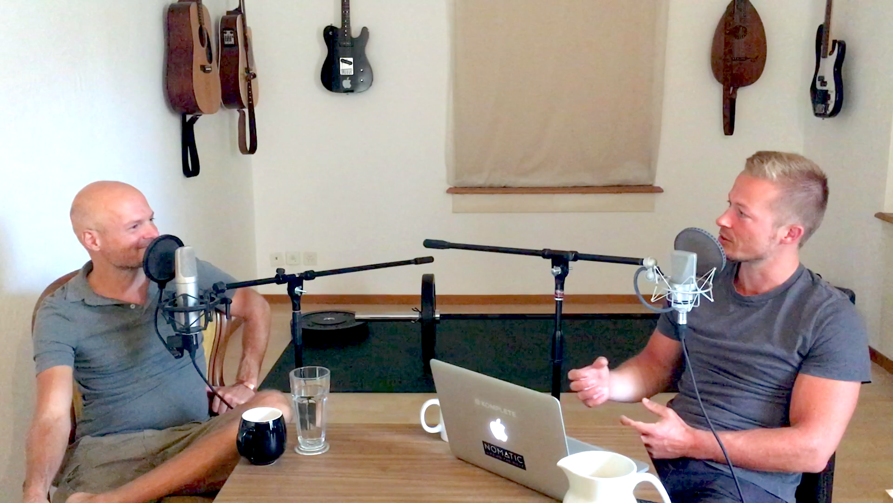
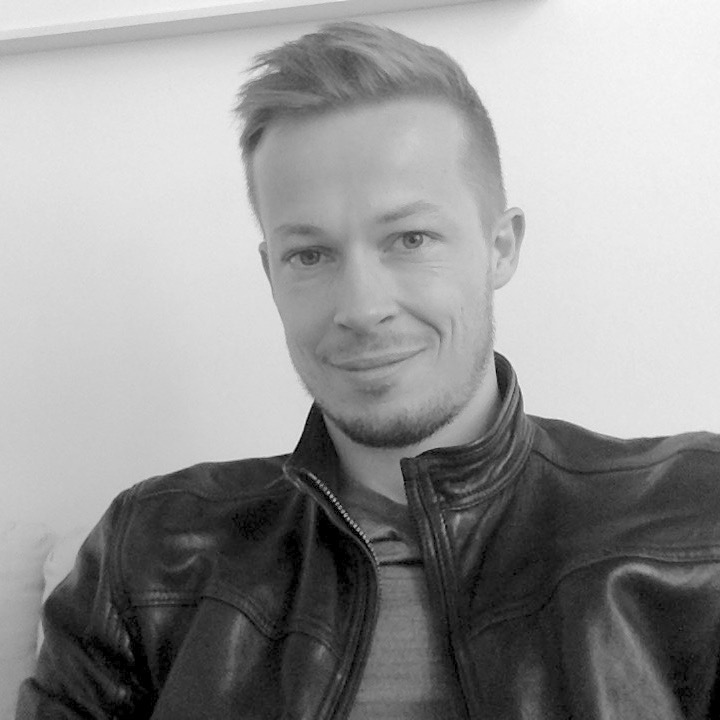

    
Flowtalk is a podcast. Our theme is "flow" as a state of ultimate focus, awareness, fulfilment, playfulness, naturalness, self-expression, productivity and inner peace.

We talk self-development, philosophy, psychology, spirituality, business, creativity, productivity, culture and more.
 
 

    

        

            
        

        

            
        

        

            
        

    

    
    

      

         <h2>#2 - Sebastian Telle</h2>
      

    

    

      

         
      

      

         Sebastian Telle ist App-Architekt und kreativer Querdenker. Wir unterhielten uns über seine Hintergrundgeschichte, die neue App Flowlist und über Kommunikation.
          
          
         <a href="http://flowlistapp.com" target="_blank">flowlistapp.com</a>
      

    

    
    

      

         <h2>#1 - Nicolas Alschibaja</h2>
      

    

    

      

         
      

      

         Nicolas Alschibaja ist ein spiritueller Sucher, Autor und Coach. In dieser Pilotfolge von Flowtalk unterhalten wir uns über seine Hintergrundgeschichte sowie über Bewusstsein, Präsenz und Gelassenheit.
          
          
         <a href="http://nicolas-alschibaja.de" target="_blank">nicolas-alschibaja.de</a>
      

    

    

