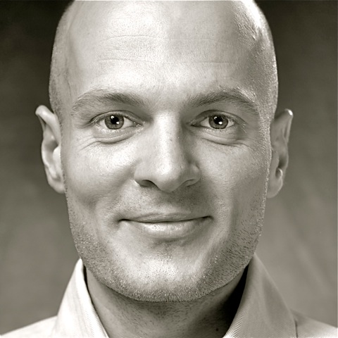

# Flowtalk

The theme of Flowtalk is "flow" as a state of ultimate focus, awareness, fulfilment, playfulness, naturalness, self-expression, productivity and inner peace. 

We talk self-development, philosophy, psychology, spirituality, business, creativity, productivity, culture and more.

## #1 - Nicolas Alschibaja

 Nicolas Alschibaja ist ein spiritueller Sucher, Autor und Coach. In dieser Pilotfolge von Flowtalk unterhalten wir uns über seine Hintergrundgeschichte sowie über Bewusstsein, Präsenz und Gelassenheit.

[nicolas-alschibaja.de](http://nicolas-alschibaja.de)

