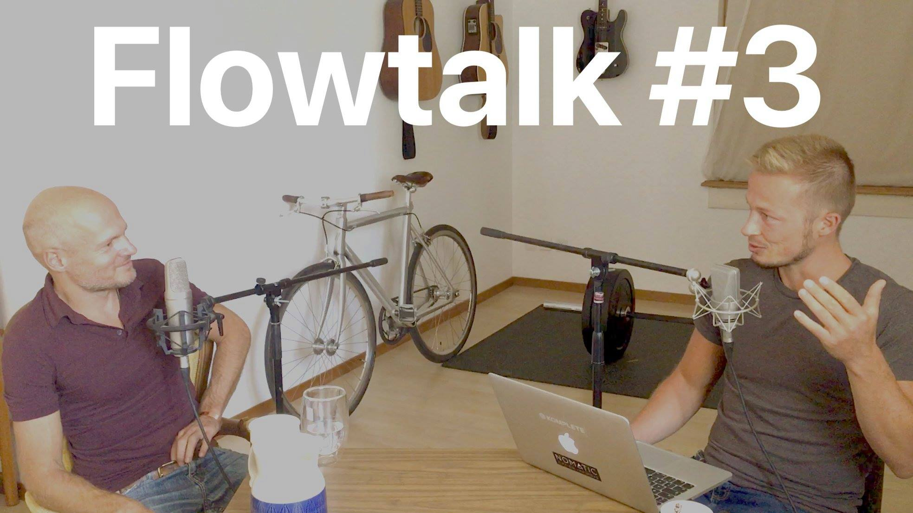

    
Flowtalk is a (mostly german) podcast. Our theme is **flow** as a state of ultimate focus, awareness, fulfilment, playfulness, naturalness, self-expression, productivity and inner peace. We talk about self-development, philosophy, psychology, spirituality, business, creativity, society, culture and more.
 
 

    
    

        <a href="https://www.youtube.com/channel/UCy3HpEO3Jr-iuvoEAFkpHVg"
            target="_blank"
            class="ft-podcast-link"
            style="background:url(logos/youtube@2x.png) no-repeat;background-size:contain;background-position:left;">
            YouTube
        </a>
    

    
    

        <a href="https://itunes.apple.com/us/podcast/flowtalk/id1434968512?mt=2"
            target="_blank"
            class="ft-podcast-link"
            style="background:url(logos/apple_podcasts@2x.png) no-repeat;background-size:contain;background-position:left;">
            Apple Podcasts
        </a>
    

    
    

        <a href="https://open.spotify.com/show/48LmW6cNC12NAFzOhF4f56"
            target="_blank"
            class="ft-podcast-link"
            style="background:url(logos/spotify@2x.png) no-repeat;background-size:contain;background-position:left;">
            Spotify
        </a>
    

    
    

        <a href="https://anchor.fm/flowtalk/"
            target="_blank"
            class="ft-podcast-link"
            style="background:url(logos/anchor@2x.png) no-repeat;background-size:contain;background-position:left;">
            Anchor
        </a>
    

    
    

        <a href="https://www.stitcher.com/podcast/flowtoolz/flowtalk"
            target="_blank"
            class="ft-podcast-link"
            style="background:url(logos/stitcher@2x.png) no-repeat;background-size:contain;background-position:left;">
            Stitcher
        </a>
    

    
    

        <a href="https://www.google.com/podcasts?feed=aHR0cHM6Ly9hbmNob3IuZm0vcy82ZGRkYmI4L3BvZGNhc3QvcnNz"
            target="_blank"
            class="ft-podcast-link"
            style="background:url(logos/google_podcasts_outline@2x.png) no-repeat;background-size:contain;background-position:left;">
            Google Podcasts
        </a>
    

    
    

        <a href="https://pca.st/jUi8"
            target="_blank"
            class="ft-podcast-link"
            style="background:url(logos/pocket_casts@2x.png) no-repeat;background-size:contain;background-position:left;">
            Pocket Casts
        </a>
    

    
    

        <a href="https://www.breaker.audio/flowtalk"
            target="_blank"
            class="ft-podcast-link"
            style="background:url(logos/breaker@2x.png) no-repeat;background-size:contain;background-position:left;">
            Breaker
        </a>
    

    
    

        <a href="https://pca.st/jUi8"
            target="_blank"
            class="ft-podcast-link"
            style="background:url(logos/radiopublic@2x.png) no-repeat;background-size:contain;background-position:left;">
            Radio Public
        </a>
    

    

<h2>#4 - Nicolas Alschibaja, Sebastian Telle</h2>

    

        
            

    

        Nicolas ist spiritueller Sucher, Autor und Coach. Sebastian ist kreativer Querdenker und App-Architekt. Wir unterhielten uns diesmal über den Widerstreit zwischen kreativem Schaffen und bewusstem Loslassen, sowie über die Relativität von Werten.
    

<h2>#3 - Nicolas Alschibaja, Sebastian Telle</h2>

    

        
    

    

        Nicolas ist spiritueller Sucher, Autor und Coach. Sebastian ist kreativer Querdenker und App-Architekt. Wir unterhielten uns über Authentizität, Flow, Kreativität, Gesellschaft, Einheitsbewusstsein, Wahrnehmung, Geist, Intuition und Meditation.
    

<h2>#2 - Sebastian Telle</h2>

    

        
    

    

        Sebastian Telle ist App-Architekt und kreativer Querdenker. Wir unterhielten uns über seine Hintergrundgeschichte, die neue App Flowlist und über Kommunikation.
         
         
        <a href="http://flowlistapp.com" target="_blank">
            flowlistapp.com
        </a>
    

<h2>#1 - Nicolas Alschibaja</h2>

    

        
    

    

        Nicolas Alschibaja ist ein spiritueller Sucher, Autor und Coach. In dieser Pilotfolge von Flowtalk unterhalten wir uns über seine Hintergrundgeschichte sowie über Bewusstsein, Präsenz und Gelassenheit.
         
         
        <a href="http://nicolas-alschibaja.de" target="_blank">
            nicolas-alschibaja.de
        </a>
    

