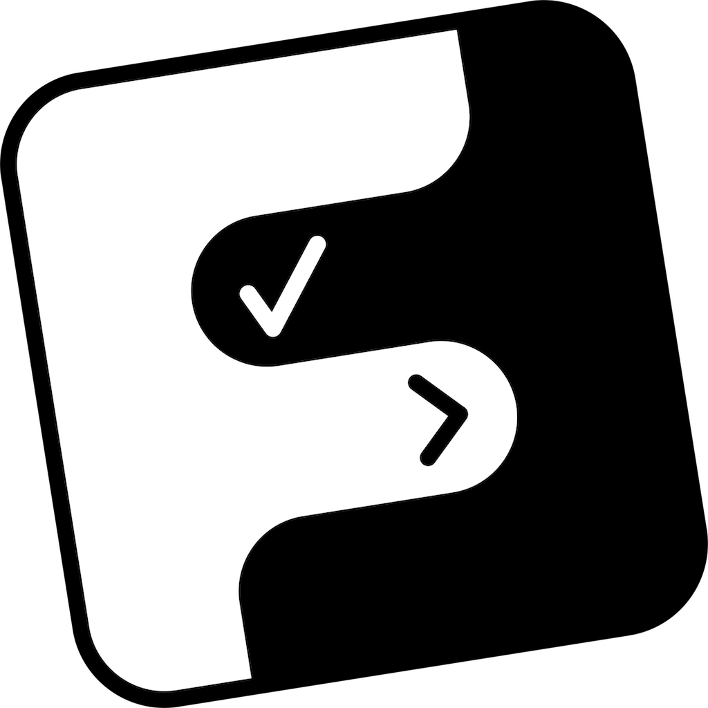
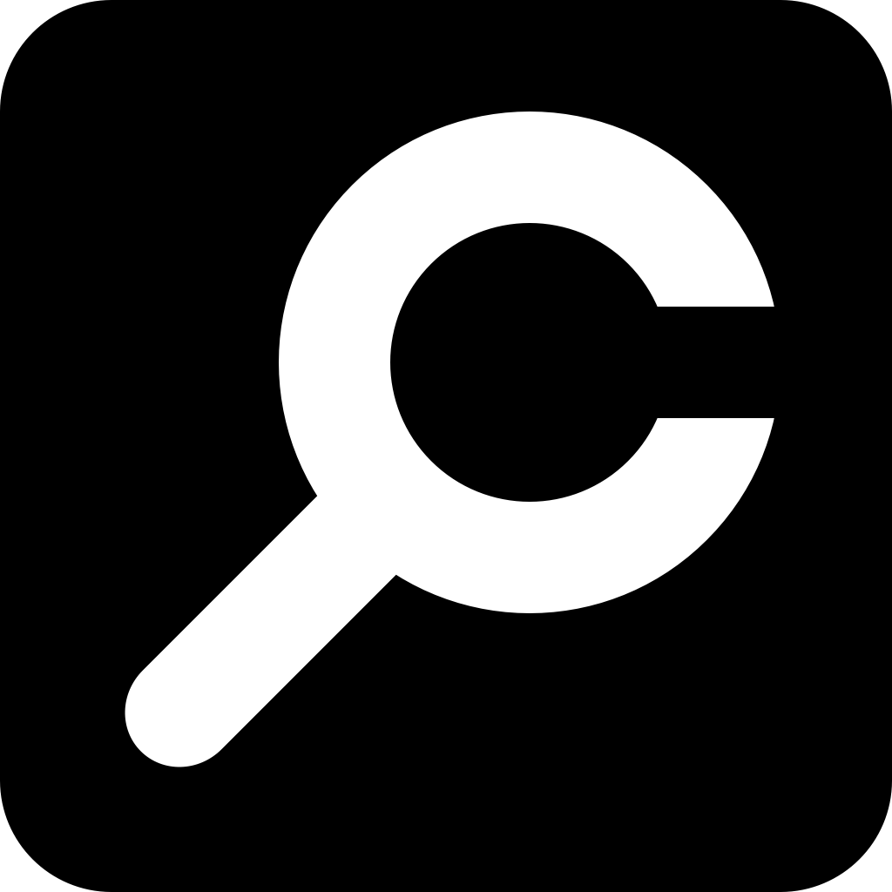
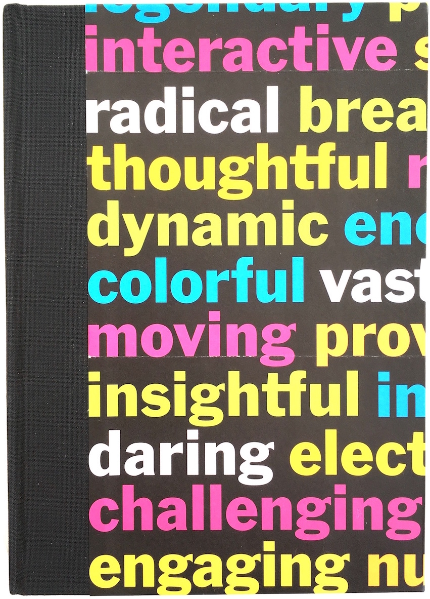
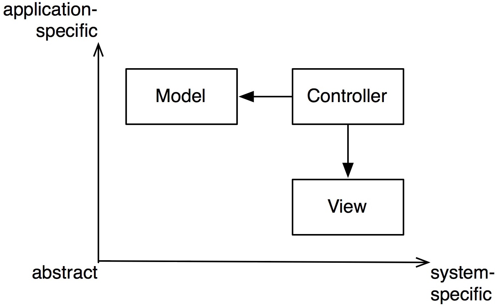
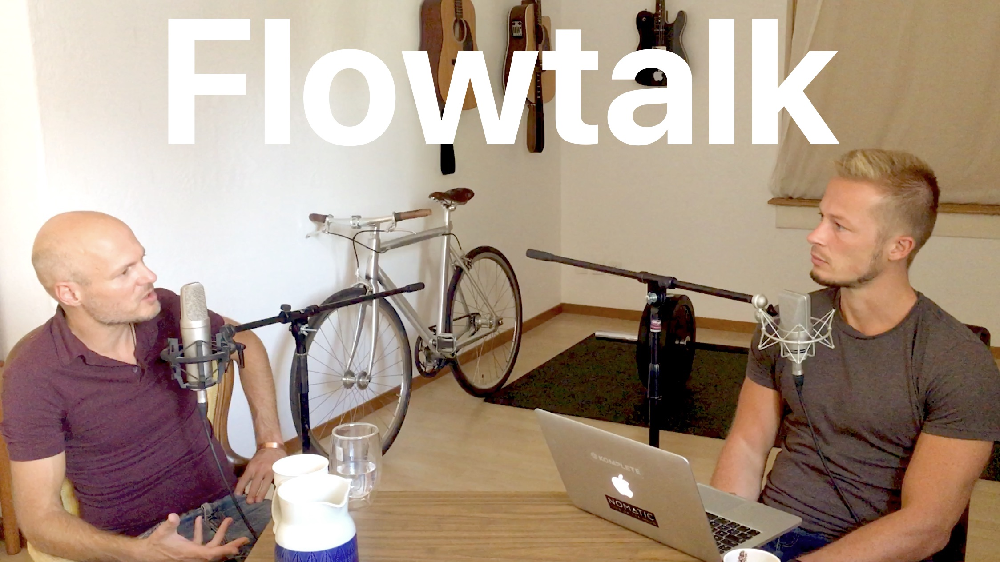
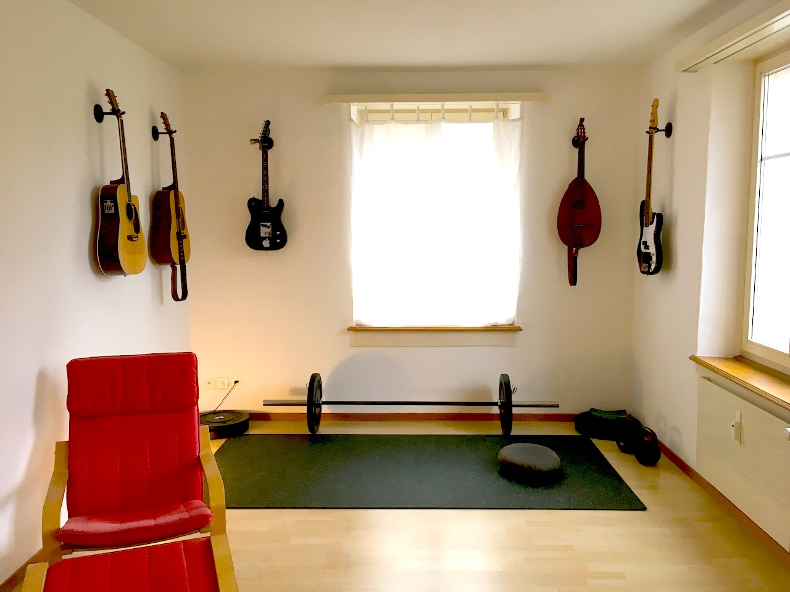
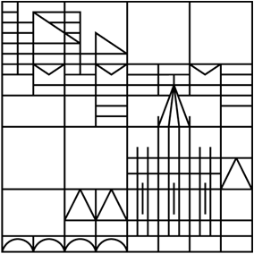

## [Flowlist](/flowlist)

 Flowlist is an elegant tool for self-management and creative writing. Unbelievably easy yet infinitely flexible. Organize your brain in flow!

I created Flowlist for myself out of frustration with the many task management apps I used before. Now I'm happily using Flowlist every day since June 2017.  Check out <a href="/flowlist" onclick="ga('send', 'event', 'link', 'click', 'flowlistapp.com');">flowlistapp.com</a>.

The simple concept of hierarchical lists, the fully animated beautiful interface and the consequent design for creative focus make Flowlist unique, widely applicable and incredibly fun!

Flowlist does not force your stuff into categories like "Project" or "Subtask". Instead, items are universal and may contain other items, like folders on your Mac contain other folders. You're free to organize yourself in your own way.

A novel interaction concept combines intuitive key commands, a radically clean interface and meaningful animations, so you can rapidly navigate and edit your item hierarchy in a state of deep concentration.

## Cocoalytics

 An app for Swift code visualization and quality analytics for Cocoa projects, i.e. around iOS, macOS and tvOS. The new MVP just shows which files of a code base might need to be split up, based on lines of code.

Download from  <a href="/cocoalytics/cocoalytics.zip">www.flowtoolz.com/cocoalytics/cocoalytics.zip</a>.

I've done a lot of conceptual work, copywriting, market analysis and so forth. And I explored the idea through the <a href="/2016/05/15/london-real-business-accelerator.html">London Real Business Accelerator</a>.

Watch an early pitch [here](https://www.youtube.com/watch?v=dYZx7Kflhmw). If you're interested in collaborating on such a project contact me. More is to come at [cocoalytics.com](http://cocoalytics.com).

## The 33Day-Diary

 A structured journal that leads through a sort of meditation routine for 33 days, based on positive psychology. A page with more infos is available in english  at [www.flowtoolz.com/diary](/diary) and in german at [www.flowtoolz.com/tagebuch](/tagebuch).

I needed something like the [five minute journal](http://fiveminutejournal.com) for myself, but I was inspired to integrate some extensions into that idea and wanted it to be a beautiful physical object...

Now, the 3rd revision is done. A collaborator of mine handcrafts the books and gives every copy a unique design. I did a photo shoot of a bunch of example copies and had it professionally translated.

## [Flowtoolz Github](https://github.com/flowtoolz/)

 I just started to put some [code on Github](https://github.com/flowtoolz/). Most notably, I released [GetLaid](https://github.com/flowtoolz/GetLaid), an AutoLayout wrapper and [SwiftObserver](https://github.com/flowtoolz/SwiftObserver), a framework for reactive programming, which you can install via [Cocoapods](https://cocoapods.org) and via [Carthage](https://github.com/Carthage/Carthage).

You'll also find [UIObserver](https://github.com/flowtoolz/UIObserver) (a UI layer for SwiftObserver) and the general helper frameworks [SwiftyToolz](https://github.com/flowtoolz/SwiftyToolz), [FoundationToolz](https://github.com/flowtoolz/FoundationToolz) and [UIToolz](https://github.com/flowtoolz/UIToolz), only UIToolz is not yet available via Carthage or Cocoapods.

## Zen in the Art of Software Architecture

 ... is the tongue-in-cheek working title of a book I'm writing. It will be a casual and entertaining but also consistent and systematic dive into the fundamental principles that make software hold together or fall apart.

I've been obsessing about the nature of software structure since I started coding at age 12. Now I'm gathering and integrating all my notes and writings on the subject. The draft is currently 80+ pages long.

The book is not exclusively directed at coders, but at everyone in the periphery of software development. It will have no code in it, not even pseudo code! It offers a fundamental and new perspective on the qualitative aspects of software, and it will contain lots of hand-drawn diagrams.

As soon as the overall "story arc" is settled, I'll extract some parts as blog posts...

## [Flowtalk](/flowtalk)

 Flowtalk is a podcast. Our theme is “flow” as a state of ultimate focus, awareness, fulfilment, playfulness, naturalness, self-expression, productivity and inner peace.

We talk self-development, philosophy, psychology, spirituality, business, creativity, productivity, culture and more. Visit <a href="/flowtalk" onclick="ga('send', 'event', 'link', 'click', 'www.flowtoolz.com/flowtalk');">www.flowtoolz.com/flowtalk</a>.

## [Sebastian Telle](https://www.facebook.com/pg/sebastiantellemusik/posts)

 I write and produce indie pop songs under my real name [Sebastian Telle](https://www.facebook.com/pg/sebastiantellemusik/posts) (formerly  as *Mellowtree*).

Dreamy, spacey, catchy art pop. I've been following this vision since I was 14, and created [countless](/2017/09/17/break-free-from-your-musical-baggage.html) ideas.

Currently I'm focusing on generating more viable output, i.e. I'm working on a 10 track debut album. Collaborators are welcome, in particular instrumentalists.

## Flowtoolz Studio

 Since around 1996, I've been growing (gardening?) a music home studio, and I'm pretty happy with the minimal but effective and high quality setup.

Since I'm drifting more and more to the production side, I collaborate with musicians and produce their demos. A page with details will follow...

## StockToolz

In 2017, I got into trading stocks, in particular swing trading via chart technique. I built an app that visualizes historic stock data from an unofficial API of yahoo finance.

The app also allowed me to test simple strategies and see how they compete. Supported by this app, I made money with every single trade, but I wasn't too systematic about it. I'll certainly come back to this project in the future.

## ParetoSpeak

A simple but highly effective app for expanding your vocabulary in your own or in a foreign language. It trains your recall of the most used terms that you recently didn't know. The prototype worked well.

I hope I can pick this up at some point. If you're interested in collaborating on such a project, download a german summary of this vision [here](https://bitbucket.org/flowtoolz/paretospeak/raw/6817549bd8a75c04097d1092b612f032a593d798/Design/PS_Design_Document.pdf).

## Human-Audio Interaction Lab

During my master studies in Information Engineering, I became obsessed with a vision of a novel music composition interface. So I made it the subject of my thesis.

While I still stand behind the [36 requirements for music composition interfaces](writings/what_music_composition_interfaces_require.pdf), my solution suffered from overthinking, and the academic prototype is not a minimal viable product. I don't know that I will ever come back to this, since other ideas have more commercial potential.

## Academic Writings

 [Listing all Maximal Cliques of Large Sparse Graphs](writings/maximal_cliques.pdf)

[Direct Manipulation](writings/direct_manipulation.pdf)

[GPU Based Stochastic Foliage Simplification](writings/gpu_based_stochastic_foliage_simplification.pdf)

[Die Erkenntnisleistung der Literatur](writings/die_erkenntnisleistung_der_literatur.pdf)

[Deriving Semantic Word Distances from Web Search Hits](writings/word_distances_from_search hits.pdf)

[Visualization of Subspace Clusterings for High Dimensional Data](writings/visualization_of_subspace_clusterings_for_high_dimensional_data.pdf)

[What Music Composition Interfaces Require](writings/what_music_composition_interfaces_require.pdf)

[HAIL: Developing the Human-Audio Interaction Lab](writings/human_audio_interaction_lab.pdf)

[Interaction Design for Mobile Music Composition](writings/interaction_design_for_mobile_music_composition.pdf)

[Idea for a metric distance function ("semantic diameter") on n feature vectors, rooted in information theory](writings/metric_distance_function_idea.pdf)

   - While I developed and formulated the above idea, I sifted through the scientific literature for weeks. However, I couldn't find this articulated anywhere. This may have changed. If anyone has seen a description, term or formula for this, please let me know!

      This distance function seems very appropriate and natural for clustering, information retrieval and data mining applications where objects (like documents) can be expressed as probability vectors (like term frequencies). It's a metric, applicable to sets of n vectors (documents), and it's actually based on measuring information (entropy). Having considered many practical criteria, I'm convinced this function expresses semantic distance better than any other distance function I came across.
