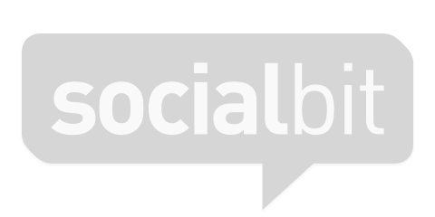
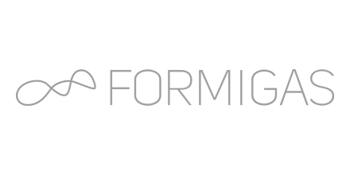
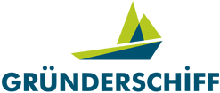
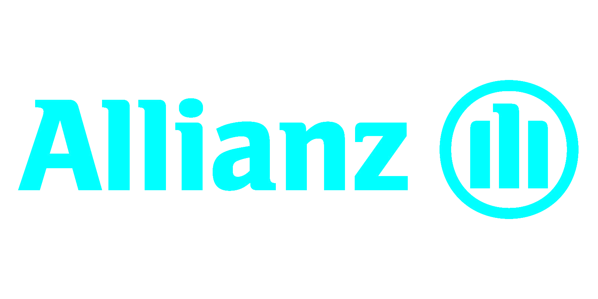

## Got a great business or idea?

We don't just build the app.

* We also understand your goal, help you work out a strategy and then build exactly the app that lets you implement your vision.

* We empower your whole journey, from concept and design over implementation and testing to marketing and release.

* We bring your app to the right platforms. Whether it's phones, TV or the web. We make it fully customized and deeply engaging.

## Manifesto

#### Our Conviction
We are experienced, principled and oppinionated software craftsmen who believe there often <i>is</i> a right and a wrong way to do things.

<i>Agile</i> is not a marketing buzzword to us. We carry the ideas of the agile manifesto in our hearts. All our work rests on the following three principles.

#### Domain-Driven Design
We immerse ourselves into your application domain and model its mechanics together with you. We are convinced that a deep understanding of the domain makes for excellent software and excellent partnerships.

Our domain-driven approach entails that we are not attached to any technology. Instead we apply the technologies that best serve your goal.

#### Craftsmanship
We sustain development speed even in late stages of complex projects because we apply test-driven development and produce clean code and architecture.

Since clean architecture yields highly reusable code, we're constantly growing a code library that powers development accross different projects.

#### Rapid Iteration
Delivering in rapid iterations allows us to scale the product with the invested resources and to react quickly to new information.

With each iteration, we deliver a viable product by implementing the feature that offers the greatest return of investment.

## Team
Flowtoolz is a network of passionate software artists who love turning exciting ideas into reality. We collaborate with selected experts from all kinds of professional backgrounds like computer science, fine arts, industrial design, business administration and online marketing.

Our guys and girls are partners rather than employees. They  are proactive, self-reliant, creative, independent and passionate. The benefits for you:

* You don't just get high quality but also innovation, style and a unique perspective.

* You get a wide range of services from people who understand the context of your project.

* You get exactly the expertise that applies to your unique project. From real specialists.

## Clients

 (http://www.socialbit.de)

        "http://www.formigas.de"

            "https://itunes.apple.com/ch/app/holidaycheck/id431838682?mt=8"

            "http://www.londonrealacademy.com"

            "http://www.gruenderschiff.de"

            "http://www.allianz.com"

